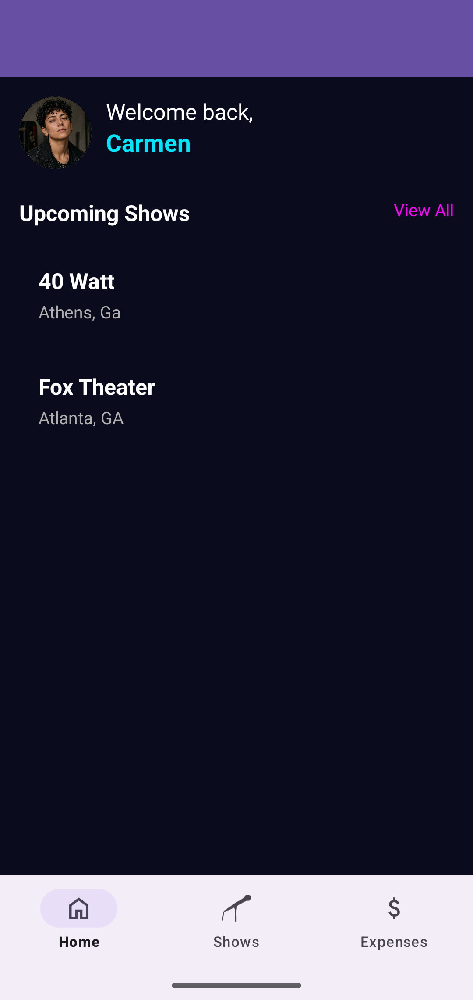
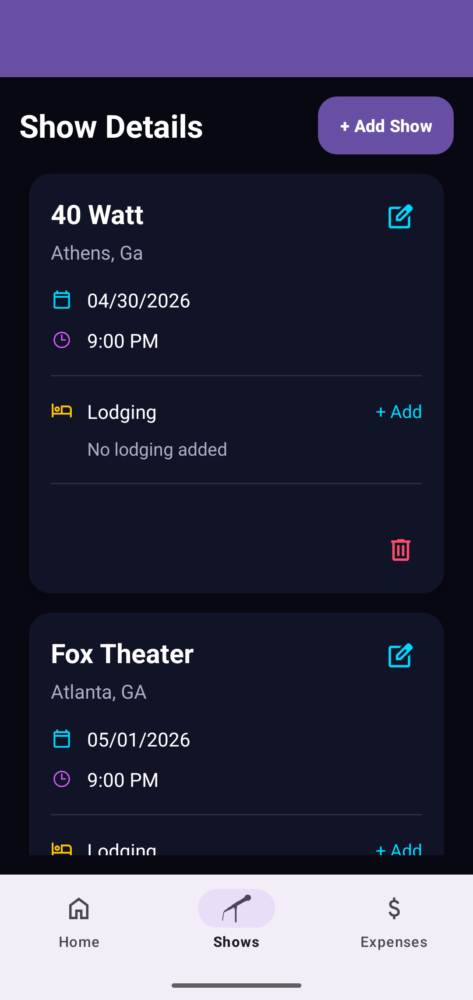
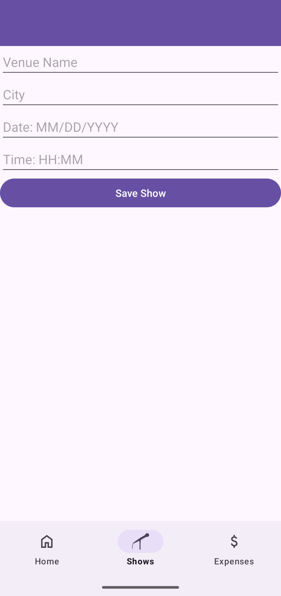
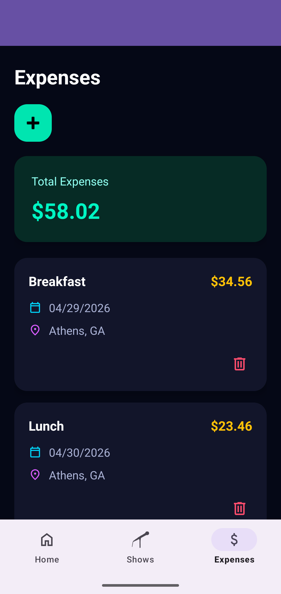

# Touring Musician Management App

## Overview

This project is an Android application designed to help touring musicians manage their schedules, lodging, and expenses while on the road. The app provides a centralized platform for organizing tour information, reducing the stress of managing travel logistics, and improving access to important tour details.

This project was developed as a capstone project for the Bachelor of Science program in Software Application Development and Human-Computer Interaction.

---

## Features

### Show Management

* Add, edit, and delete shows
* Store venue information, city, date, and time
* View all upcoming performances in one location

### Lodging Management

* Associate lodging information with specific shows
* Store hotel names and addresses
* Track check-in and check-out dates
* Edit lodging information as travel plans change

### Expense Tracking

* Record expenses related to a tour
* Track expense title, amount, date, and location
* View all expenses in a dedicated expense screen
* Monitor overall tour spending

### Home Dashboard

* Quick view of upcoming shows
* Easy navigation to detailed show information
* Centralized access to major app functions


---

## Technologies Used

* Kotlin
* Android Studio
* Android Jetpack
* Room Database
* RecyclerView
* LiveData
* ViewModel
* Repository Pattern
* Navigation Component
* Material Design Components
* MVVM Architecture

---

## Architecture

The application follows the **MVVM (Model-View-ViewModel)** architectural pattern.

### Model

* Room Database
* Entities

  * Show
  * Lodging
  * Expense
* Data Access Objects (DAOs)

### View

* Fragments
* RecyclerViews
* XML Layouts
* Material UI Components

### ViewModel

* ShowViewModel
* LodgingViewModel
* ExpenseViewModel

### Repository

* ShowRepository
* LodgingRepository
* ExpenseRepository

---

## Database Structure

### Show

| Field | Type   |
| ----- | ------ |
| id    | Int    |
| city | String |
| venue  | String |
| date  | String |
| time  | String |

### Lodging

| Field     | Type   |
| --------- | ------ |
| id        | Int    |
| showId    | Int    |
| hotelName | String |
| address   | String |
| checkIn   | String |
| checkOut  | String |

### Expense

| Field    | Type   |
| -------- | ------ |
| id       | Int    |
| showId   | Int    |
| name    | String |
| amount   | Double |
| date     | String |
| location | String |

---

## Screens

### Home Screen

Displays:

* User dashboard
* Upcoming shows at a glance
* Navigation to all shows and expenses

### Show Details Screen

Displays:

* Show information
* Lodging information
* Edit and delete options

### Add/Edit Show Screen

Allows users to:

* Create new shows
* Update existing shows

### Add/Edit Lodging Screen

Allows users to:

* Add lodging information
* Update lodging details

### Expense Screen

Displays:

* All expenses
* Total expenses
* Expense management options

### Add Expense Screen

Allows users to:

* Record expenses
* Delete existing expense records

---
## Screenshots

## Screenshots

### Home Screen

<p align="center">
  
</p>

### Show Details

<p align="center">
  
</p>

### Add Show

<p align="center">
  
</p>

### Expense Tracking

<p align="center">
  
</p>

---

## Installation

### Clone the Repository

```bash
git clone https://github.com/howell-m/Capstone.git
```

### Open the Project

1. Open the project in Android Studio.
2. Allow Gradle to sync.
3. Build and run the application on an emulator or Android device.

---

## Future Improvements

Potential future improvements include:

* Tour itinerary maps
* Edit expenses
* Flight tracking
* Setlist management
* Band member messaging
* Cloud synchronization
* PDF expense reports
* Calendar integration
* Push notifications and reminders
* Photo attachments for receipts

---

## Learning Outcomes

This project demonstrates knowledge and application of:

* Android Application Development
* Kotlin Programming
* User-Centered Design Principles
* Human-Computer Interaction
* Database Design
* Room Persistence Library
* MVVM Architecture
* Software Engineering Practices
* Navigation Component Implementation
* Mobile UI/UX Design

---

## Author

**Madelyn Howell**

Bachelor of Science, Software Application Development and Human-Computer Interaction
Minor: Informatics
Mercer University

---

## License

This project was created for educational purposes as part of a university capstone project.
